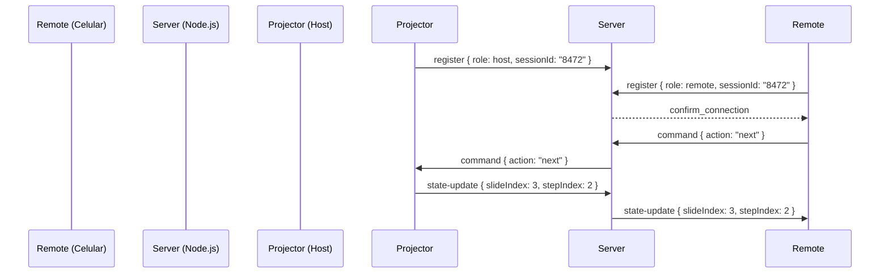

# FABSLIDES.md — Skill Técnica Canônica do Motor de Apresentações HTML5

> **Para agentes de IA:** Este é o documento vivo de referência técnica do FabSlides.
> Leia este arquivo antes de criar, modificar ou diagnosticar qualquer apresentação baseada no motor.
> Mantenha-o atualizado após cada nova funcionalidade implementada ou decisão de design consolidada.

---

## 0. Identidade e Localização do Projeto

| Campo | Valor |
|---|---|
| **Repositório canônico** | `C:\Users\fabio\OneDrive\Sync\Dev\FabSlides` |
| **Boilerplate base** | `C:\Users\fabio\OneDrive\Sync\Dev\FabSlides\boilerplate\` |
| **README do projeto** | `C:\Users\fabio\OneDrive\Sync\Dev\FabSlides\README.md` |
| **Versão atual** | v4.1 |
| **Apresentação de referência** | `C:\Users\fabio\OneDrive\Sync\Cofre\Mestrado\1T26_FGEC\Aula 11 - Apresentação dos trabalhos finais\FLL_Apresentação-A11\` |
| **Manual derivado** | `…\Aula 11\PRESENTATION_ENGINE.md` |

---

## 1. Arquitetura de Arquivos Obrigatória

Todo projeto FabSlides deve seguir esta estrutura de pastas:

```
meu-projeto/
├── index.html            # Projetor — tela de projeção para o público
├── style.css             # Design System — tokens, tipografia, animações
├── main.js               # Lógica — scroll, passos, teclado, WebSocket client
│
├── apresentador/
│   └── index.html        # Console — cockpit do orador com notas e Gaveta de Referências
│
├── remoto/
│   └── index.html        # Controle Remoto — interface touch mobile com cronômetro
│
├── server/
│   ├── index.js          # Servidor de Sinalização WebSocket (Node.js)
│   ├── package.json      # Dependências mínimas (ws@8)
│   └── Dockerfile        # Deploy em nuvem (Coolify / Docker)
│
└── material/             # Assets estáticos: PDFs, Markdowns de referência
```

---

## 2. Glossário de Nomes Oficiais

> Ao interagir com o usuário ou escrever código, use sempre os termos da coluna **Termo Oficial**.

| Termos Informais / Sinônimos | Termo Oficial FabSlides |
|---|---|
| Slide Frame, Snap, Tela | **Slide** |
| Ações, Revelações, Steps, Animações Locais | **Passos (Steps)** |
| Projetor, Palco, Tela Cheia | **Projetor (Projector)** |
| Cockpit, Painel, Console | **Console (Presenter Console)** |
| Controle, Celular, Remoto Mobile | **Controle Remoto (Remote)** |
| Servidor, Sinalizador, Relay | **Servidor (Signaling Server)** |
| Notas, Roteiro, Talking Points | **Notas de Palco (Stage Notes)** |
| Drawer, Sidebar, Gaveta | **Gaveta de Referências (Reference Drawer)** |
| Tipo de Ação, Categoria de Step | **Action Type** |

---

## 3. Mecanismo Central — Storytelling por Passos

### 3.1 O atributo `data-step`

Cada elemento que deve ser revelado em sequência recebe `data-step="N"` (N começa em 1).

**Regras obrigatórias:**
- Elementos estruturais fixos (cabeçalhos, rodapés, labels) **NÃO** recebem `data-step` — entram visíveis imediatamente.
- A numeração deve ser contínua e crescente dentro de cada `<section>`.
- O JS lê todos os `[data-step]` da seção ativa e os ordena numericamente.

### 3.2 Comportamento de Revelação

| Gatilho de Navegação | Comportamento |
|---|---|
| **Seta Direita / Barra de Espaço** | Revela o próximo passo (storytelling de palco sequencial) |
| **Seta Esquerda** | Oculta o último passo revelado (retrocesso local) |
| **Seta Baixo / Scroll** | Vai ao próximo slide exibindo **todos** os passos imediatamente |
| **Seta Cima** | Volta ao slide anterior exibindo **todos** os passos imediatamente |
| **Clique no indicador lateral** | Vai ao slide clicado exibindo **todos** os passos imediatamente |

### 3.3 CSS Base de Revelação

```css
[data-step] {
  opacity: 0;
  transform: translateY(15px);
  transition: opacity 0.6s ease, transform 0.6s ease;
}
[data-step].active-step {
  opacity: 1;
  transform: translateY(0);
}
```

---

## 4. Taxonomia Conceitual de Design e Storytelling (3 Níveis Lógicos)

O FabSlides organiza a anatomia, o design de interface e a física de animação dos slides em **três níveis lógicos independentes**. Isso remove a complexidade dos termos brutos de CSS e JS, oferecendo uma linguagem pura de design declarativo para agentes de IA e desenvolvedores.

```
Nível 1: CAMADA ESTRUTURAL (Onde se localiza no slide?)
   │
   ├── Nível 2: TIPO DE COMPONENTE (Qual é a função do elemento?)
   │      │
   │      └── Nível 3: COMPORTAMENTO DINÂMICO (Como ele se revela / reage?)
```

---

### Nível 1: Camada Estrutural (A Área de Atuação)
Define o posicionamento macro e o escopo de atuação do elemento dentro da tela-canvas do slide:

1.  **`Camada de Cabeçalho (Header)`**: Zona superior imediata de ambientação e ancoragem do slide.
2.  **`Camada de Conteúdo (Body)`**: Zona principal (área útil central) destinada aos dados, diagramas e discussões.
3.  **`Camada de Rodapé (Footer)`**: Zona inferior focada em notas e elementos de apoio.

---

### Nível 2: Tipo de Componente (A Função Semântica)
Define a estrutura semântica e visual utilizada para contar a história em cada camada.

*   **Na Camada de Cabeçalho:**
    *   `Cabeçalho Ancorador`: Título principal + categoria do slide.
    *   `Bloco de Contextualização`: Texto corrido ou citação introdutória de ambientação.
*   **Na Camada de Conteúdo:**
    *   `Card de Destaque Métrico`: Bloco focado em exibir estatísticas monumentais e rotulagens.
    *   `Card de Mídia Geográfica`: Painel dedicado a mapas estáticos em alta definição e marcadores dinâmicos.
    *   `Painel de Abas Lineares`: Sistema de exibição de abas sincronizadas a mídias sob o mesmo passo.
    *   `Diagrama de Processo`: SVG estruturado ou fluxo conectado, composto por `Etapas do Fluxo`.
    *   `Coluna de Contraste`: Divisões paralelas de layout para exibição paralela (ex: Split-Screen 50/50).
*   **Na Camada de Rodapé:**
    *   `Legenda Mapeadora`: Tradutor visual de cores, siglas e termos da teoria.
    *   `Nota Legal ou Referência`: Citações normativas, fontes e selos regulatórios.

---

### Nível 3: Comportamento Dinâmico (A Física de Revelação)
Define a transição e a movimentação visual de um elemento de storytelling no seu respectivo passo (`data-step`).

1.  **`Entrada Imediata`** (`static`): O elemento é exibido instantaneamente ao carregar o slide (Estado 0).
2.  **`Revelação Elevada`** (`slide-up`): O elemento surge com uma transição suave subindo fisicamente e esmaecendo na tela. Padrão para cartões de status e blocos de fechamento.
3.  **`Iluminação Local`** (`highlight`): O elemento já está renderizado no slide em tom sutil (opacidade ~0.25) e "acende" com 100% de cor e destaque no seu passo correspondente, garantindo integridade visual à tela.
4.  **`Comutação Exclusiva`** (`linear-tabs`): A revelação esconde o conteúdo anterior de forma exclusiva, ativando e pausando mídias (vídeos) sincronizadas.
5.  **`Transição Geométrica`** (`physical-stretch`): Altera fisicamente a largura, altura ou proporção geométrica de um elemento na tela (ex: autoclaves ou linhas do tempo).
6.  **`Gatilho Reativo`** (`pulse`): Dispara micro-animações cíclicas e infinitas (como marcadores de pulso) a partir da revelação do contêiner.

---

## 5. Feature Library (Boilerplates Prontos)

Esta biblioteca contém os blocos canônicos de código (HTML, CSS e JS) prontos para replicação em qualquer apresentação FabSlides.

### Feature 1: Diagrama de Processo Interativo com Iluminação Local

Estrutura ideal para apresentar fluxos de engenharia, sequenciamentos temporais ou VSMs mantendo o diagrama esteticamente visível em segundo plano sem quebrar o layout da tela.

#### 1. HTML Declarativo
```html
<div class="vsm-svg-wrapper">
  <svg viewBox="0 0 1000 160" width="100%" height="100%">
    <!-- Nó do Diagrama (Física: Iluminação Local) -->
    <g class="vsm-node" data-step="1" transform="translate(20, 20)">
      <rect x="0" y="0" width="130" height="90" rx="6" fill="#FFFFFF" stroke="#3A7DCA" stroke-width="2.5"/>
      <rect x="0" y="0" width="130" height="24" rx="6 6 0 0" fill="#3A7DCA"/>
      <text x="65" y="16" fill="#FFFFFF" font-size="10" font-family="Outfit" font-weight="700" text-anchor="middle">RECEÇÃO & TRIAGEM</text>
      <text x="65" y="48" fill="#0B1E36" font-size="11" font-family="Outfit" font-weight="700" text-anchor="middle">Janela de Safra</text>
      <text x="65" y="65" fill="#5A6E85" font-size="9" font-family="Outfit" text-anchor="middle">Tempo: ~2 h (F)</text>
    </g>
    
    <!-- Seta Conectora Simples -->
    <path d="M 160 65 L 180 65" stroke="#5A6E85" stroke-width="2" marker-end="url(#arrow)"/>
  </svg>
</div>
```

#### 2. CSS Canônico
```css
/* Estado Inicial: Opacidade de Fundo */
g[data-step] {
  opacity: 0.25;
  transition: opacity 0.5s ease, filter 0.5s ease;
}

/* Estado Ativo: Iluminado com Sombra Projetada */
g[data-step].active-step {
  opacity: 1.0;
  filter: drop-shadow(0px 8px 15px rgba(11, 30, 54, 0.12));
}
```

#### 3. JS de Storytelling
O motor genérico adiciona `.active-step` sequencialmente. Nenhuma lógica imperativa por slide é necessária, pois a física de iluminação é gerida de forma puramente declarativa através do seletor CSS do elemento SVG.

---

### Feature 2: Slide de Contraste Semântico (Split-Screen / Tela Dividida)

Esta feature é usada para criar um choque visual e conceitual direto entre duas perspectivas (ex: "Antes vs. Depois", "Tradicional vs. Lean", "Teoria vs. Prática"). Funciona semântica e visualmente como **"dois slides dentro de um"** dividindo a tela perfeitamente em 50/50.

#### 1. HTML Declarativo e Mapeamento Humano (3 Níveis)
```html
<section class="slide-section full-bleed" id="slide-contraste">
  <div class="slide-frame">
    <!-- Nível 1 (Cabeçalho): Cabeçalho Ancorador Global -->
    <header class="slide-header" style="padding-left: 5rem;">
      <p class="slide-category">04 · Fundamentação Teórica</p>
      <h2 class="slide-title">Teorias de Gestão da Produção</h2>
    </header>

    <div class="slide-content-area" data-content>
      <div class="theory-split-container">
        
        <!-- Coluna Esquerda: Argumento A -->
        <div class="theory-split-col dark-side" data-step="1">
          <!-- Nível 2 (Componente): Badge [Identificador de contexto/categoria] -->
          <div class="agro-card-badge">Visão Tradicional</div>
          
          <!-- Nível 2 (Componente): Título do Argumento [Tema principal abordado] -->
          <h3 class="agro-card-title">O Modelo de Conversão</h3>
          
          <p class="agro-card-text">
            <!-- Nível 2 (Componente): Título do Contraponto [Chamada impactante / Tese] -->
            <strong>A ilusão de enxergar apenas a tarefa</strong><br>
            
            <!-- Nível 2 (Componente): Definição do Contraponto [Texto descritivo / Conceito] -->
            Enxerga a produção como uma sequência de transformações mecânicas isoladas...
          </p>
          
          <!-- Nível 2 (Componente): Consequência [O impacto prático causado pelo argumento - Opcional] -->
          <div class="highlight-impact">
            Consequência: <em>Otimizações locais ineficazes que geram desperdício.</em>
          </div>
        </div>

        <!-- Coluna Direita: Argumento B -->
        <div class="theory-split-col light-side" data-step="2">
          <!-- Nível 2 (Componente): Badge [Identificador de contexto/categoria] -->
          <div class="agro-card-badge">Abordagem de Fluxos</div>
          
          <!-- Nível 2 (Componente): Título do Argumento [Tema principal abordado] -->
          <h3 class="agro-card-title">A Teoria de Fluxos</h3>
          
          <p class="agro-card-text">
            <!-- Nível 2 (Componente): Título do Contraponto [Chamada impactante / Tese] -->
            <strong>A distinção científica de Koskela (1992)</strong><br>
            
            <!-- Nível 2 (Componente): Definição do Contraponto [Texto descritivo / Conceito] -->
            Demonstra que a produção é constituída por duas dimensões...
          </p>
          
          <!-- Nível 2 (Componente): Consequência [O impacto prático causado - Opcional] -->
          <div class="highlight-impact">
            Consequência: <em>Foco expandido para reduzir tempos de fluxo inútil.</em>
          </div>
        </div>

      </div>
    </div>
  </div>
</section>
```

#### 2. CSS Canônico (Físicas de Contraste)
```css
/* Container de Tela Dividida */
.theory-split-container {
  display: grid;
  grid-template-columns: 1fr 1fr;
  width: 100vw;
  height: 100vh;
}

/* Colunas Individuais */
.theory-split-col {
  padding: 5rem 6rem;
  display: flex;
  flex-direction: column;
  justify-content: center;
  transition: opacity 0.8s cubic-bezier(0.16, 1, 0.3, 1), transform 0.8s ease;
}

/* Física: Começam Ocultas e Sobem */
.theory-split-col[data-step] {
  opacity: 0;
  transform: translateY(20px);
}

.theory-split-col[data-step].active-step {
  opacity: 1;
  transform: translateY(0);
}

/* Sotaque do Destaque de Consequência */
.highlight-impact {
  margin-top: 2rem;
  padding: 1.2rem 1.5rem;
  border-left: 3px solid var(--color-orange);
  background: rgba(224, 90, 16, 0.04);
}
```

---

## 6. Protocolo de Sincronização WebSocket

### 6.1 Fluxo de Mensagens



### 6.2 Mensagens do Protocolo

| Tipo | Payload | Quem envia |
|---|---|---|
| `register` | `{ sessionId, role: 'host'|'remote' }` | Projetor e Remoto no onopen |
| `command` | `{ action: 'next'|'prev' }` | Remoto → Servidor → Projetor |
| `state-update` | `{ slideIndex, stepIndex }` | Projetor → Servidor → Remoto |
| `request-state` | `{}` | Remoto ao conectar, para sincronizar teleprompter |

---

## 7. Console do Apresentador

### 7.1 Algoritmo de Dimensionamento Matemático (`scaleThumbnails`)

Garante que miniaturas `<iframe>` do Projetor ocupem exatamente 100% da coluna lateral, sem margens escuras, em qualquer resolução de monitor:

```javascript
function scaleThumbnails() {
  document.querySelectorAll('.slide-note-card').forEach(card => {
    const wrapper = card.querySelector('.slide-thumbnail-wrapper');
    const iframe  = wrapper.querySelector('iframe');
    const wrapperWidth  = wrapper.getBoundingClientRect().width;
    const scaleFactor   = wrapperWidth / 1920; // largura nativa do Projetor
    iframe.style.width          = '1920px';
    iframe.style.height         = '1080px';
    iframe.style.transform      = `scale(${scaleFactor})`;
    iframe.style.transformOrigin = 'top left';
  });
}
```

### 7.2 Gaveta de Referências (Reference Drawer)

Painel lateral retrátil que embutie um PDF local diretamente na página correta:

```html
<iframe src="../material/Artigo.pdf#page=115" width="100%" height="100%"></iframe>
```

---

## 8. Instruções para Agentes (AI Prompt)

Ao receber uma tarefa de criar ou modificar uma apresentação FabSlides:

```
1. Leia este arquivo (FABSLIDES.md) integralmente antes de qualquer ação.
2. Use o glossário da Seção 2 para todos os nomes — nunca sinônimos informais.
3. Copie o boilerplate de C:\Users\fabio\OneDrive\Sync\Dev\FabSlides\boilerplate\ como base.
4. Todo elemento de storytelling recebe data-step="N" + data-step-type="<action-type>".
5. Consulte a Taxonomia (Seção 4) para escolher o action type correto de cada passo.
6. Ao criar um novo tipo de animação não catalogado, registre-o na Seção 4 antes de continuar.
7. Após qualquer funcionalidade nova, atualize a Feature Library (Seção 5).
8. Nunca reescreva arquivos inteiros — use substituições direcionadas (DiffBlocks).
```

---

## 9. Histórico de Versões

| Versão | Data | O que mudou |
|---|---|---|
| v1.0 | — | Estrutura básica de scroll e reveal simples |
| v2.0 | — | Storytelling por Steps (`data-step` + interceptor de teclado) |
| v3.0 | — | Multi-Device Sync: Console, Remoto e WebSocket |
| v4.0 | — | Algoritmo `scaleThumbnails` para previews matemáticos |
| v4.1 | 2026-05-26 | Rebrand para FabSlides · Criação do `FABSLIDES.md` canônico · Início da Taxonomia de Action Types |

---

*FABSLIDES.md — Skill Técnica Canônica. Atualizar após cada sessão de desenvolvimento.*
