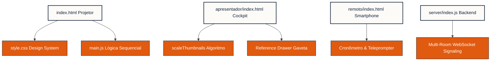

# 🎭 FabSlides: Motor de Apresentações HTML5 Interativas (Agentic Desktop Skill)

> **Status da Skill:** 🛠️ *Desenvolvimento Ativo & Autoevolutivo (Desktop IDE & CLI Environment)*  
> O **FabSlides** é um ecossistema local e de palco para apresentações interativas de alto padrão. Ele foi projetado sob a ótica de **Engenharia de Prompt e Tooling para Agentes de IA baseados em Desktop** (como Antigravity, Claude Code e IDEs integradas), otimizando o consumo de tokens e a manipulação direta do sistema de arquivos local.

---

## 1. 📖 Dicionário de Nomes (Glossário)

Para garantir que o usuário e os agentes de IA estejam sempre na mesma página e utilizando a mesma linguagem (evitando mal-entendidos por nomes sinônimos), este glossário unifica os termos oficiais do projeto:

| Termos Informais / Sinônimos Comuns | Termo Oficial FabSlides | Definição no Sistema |
|---|---|---|
| *Slide Frame*, *Snap*, *Slide Section*, *Tela* | **Slide** | O contêiner de página cheia (`<section class="slide-section">`), que se ajusta em 100vh sob a rolagem magnética do CSS Scroll-Snap. |
| *Ações*, *Revelações*, *Steps*, *Animações Locais* | **Passos (Steps)** | O storytelling de palco progressivo. Elementos anotados com `data-step="N"` que surgem em sequência ordenada ao pressionar as setas horizontais. |
| *Projetor*, *Palco principal*, *Tela Cheia*, *Frontend* | **Projetor (Projector)** | A tela de projeção exibida para o público (arquivo `index.html` na raiz do projeto). |
| *Cockpit*, *Painel*, *Console*, *Visualizador de Notas* | **Console (Presenter Console)** | A central interativa de apoio do orador (arquivo `apresentador/index.html`). |
| *Controle*, *Celular*, *Remoto Mobile*, *Controle de Palco* | **Controle Remoto (Remote)** | A interface minimalista de toque para smartphones operando o palco (arquivo `remoto/index.html`). |
| *Servidor*, *Sinalizador*, *Relay WebSocket*, *Backend* | **Servidor (Signaling Server)** | O servidor Node.js que conecta o Host (Projetor) aos clientes (Console e Remoto) usando salas de 4 dígitos (pasta `server/`). |
| *Notas de Origem*, *Roteiro*, *Talking Points*, *Textos* | **Notas de Palco (Stage Notes)** | Os cartões de apoio com tópicos ágeis de fala exibidos no Console do Apresentador. |
| *Drawer*, *Sidebar*, *Gaveta Lateral*, *Visualizador PDF* | **Gaveta de Referências (Reference Drawer)** | O painel lateral retrátil integrado ao Console para consulta direta a documentos locais na página exata. |

---

## 2. 🧱 Fragmentação de Funcionalidades (Feature Mapping)

O FabSlides adota uma **Arquitetura Desacoplada e Modular** para garantir eficiência de tokens. Os arquivos são divididos em caixas lógicas limpas para que os agentes de IA possam ler e editar pedaços específicos de código sem reescrever ou carregar arquivos monolíticos desnecessários.



---

## 3. 📉 Diretrizes de Eficiência de Tokens (Agentic Guidelines)

Trabalhar com agentes baseados em terminal local (IDE/CLI) exige restrição estrita de consumo de tokens. O FabSlides implementa a eficiência de tokens sob as seguintes regras:

1.  **Foco em Diferenciais (DiffBlocks):** O agente deve editar arquivos usando ferramentas de substituição direcionada (como `replace_file_content` ou edits via git diff) ao invés de reescrever arquivos inteiros.
2.  **Isolamento Estrito:** A lógica JS (`main.js`) e as regras globais de design (`style.css`) devem ser totalmente agnósticas. O agente não deve reescrever o motor para alterar o conteúdo de uma apresentação; ele deve alterar **apenas** a marcação HTML de conteúdo no `index.html`.
3.  **Configurações por Atributos (`data-api`):** Configurações visuais ou interativas específicas (ex: tempos de delay de entrada, ordem dos passos) devem ser declaradas diretamente no HTML via atributos `data-` (ex: `data-step`, `data-target-index`), permitindo que a IA manipule o fluxo apenas alterando strings de dados estruturadas no HTML.

---

## 4. 🔄 Protocolo de Autoevolução de Skill (Self-Evolution SkillOps)

Inspirado nos conceitos de *Lifelong Learning* e *Voyager Framework*, o FabSlides possui um motor de autoevolução em closed-loop.

Toda vez que um agente Desktop criar uma nova funcionalidade durante o desenvolvimento de qualquer projeto específico:
1.  **Generalizar:** Ele deve limpar o código específico do projeto, criando um modelo geral abstrato.
2.  **Registrar na Feature Library (Seção 4.1):** Adicionar o novo modelo de design ou interação a este arquivo `README.md`.
3.  **Atualizar Prompt da Skill (Seção 5):** Adaptar o prompt técnico para que agentes futuros saibam instanciar a funcionalidade em novos repositórios.

### 4.1 Feature Library (Biblioteca de Recursos Abstratos)

*   **[FEAT-001] Split-Screen 50/50 Dinâmico:** Dividido em duas colunas colossais integradas a opacidades aceleradas por GPU.
*   **[FEAT-002] Timeline com Expansão de Escala (Stretching Timeline):** Linha do tempo visual onde uma das barras se estica dinamicamente na ativação do step via classes CSS e CSS Transitions, excelente para ilustrar disparidades operacionais ou tempos lentos.
*   **[FEAT-003] Diagrama SVG Acoplado com Camadas Ativas:** Estrutura vetorial integrada que alterna a opacidade de camadas ou conectores pontilhados conforme a contagem de passos locais (`activeSlideSteps`).

---

## 5. 🤖 Instrução de Instanciação da Skill (AI Target Prompt)

> [!TIP]
> **Aos Agentes e IDEs de IA:** Copie o prompt abaixo quando for inicializar uma nova apresentação do FabSlides a pedido do usuário:

```text
Você é um agente desktop especializado no ecossistema FabSlides. Você foi encarregado de criar ou modificar uma apresentação interativa de alto impacto. 

Siga rigorosamente a arquitetura e nomenclatura descritas no manual C:\Users\fabio\OneDrive\Sync\Dev\FabSlides\README.md:
1. Copie o boilerplate padrão da pasta C:\Users\fabio\OneDrive\Sync\Dev\FabSlides\boilerplate para a pasta do novo projeto.
2. Crie a estrutura de slides no index.html seguindo a marcação semântica e os atributos data-step para storytelling cronológico passo-a-passo.
3. Não monolitize arquivos. Mantenha CSS, JS e HTML separados para preservar a eficiência de tokens.
4. Mapeie todas as Notas de Palco (Stage Notes) no arquivo apresentador/index.html em conformidade absoluta com o glossário de nomes oficial da engine.
```

---
*FabSlides: Evoluindo a arte das apresentações técnicas através da simbiose entre Humanos e Inteligências Artificiais no Desktop.*
